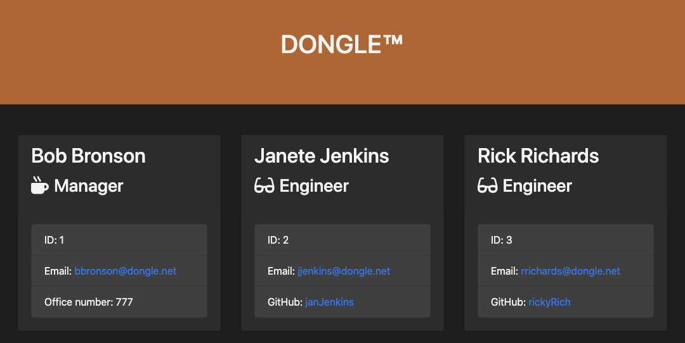

# Employee Template Engine

Team management is an essential component of any successful project. The Employee Template Engine allows team managers to stay organized with an employee catalogue generated from the command line.

Upon running this application in the terminal, the user is prompted about employee information to generate an HTML file.

## Installation

- head over to the [template-engine repository](https://github.com/roccomaniscalco/template-engine)
- Press the green _code_ button and select method of download

## Usage

- Must have [node.js](https://nodejs.org/en/) installed
- Run `npm i` to install dependencies
- Run app.js in [inquirer](https://www.npmjs.com/package/inquirer#support) supported terminals

## License

Licensed under the [MIT](https://opensource.org/licenses/MIT) license.
